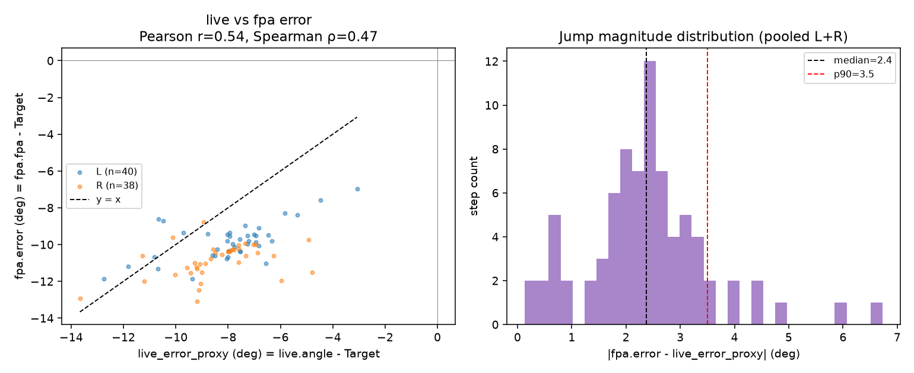

# Task 15 — `live.angle` vs `fpa.error` consistency check (IF live-mode go/no-go)

**Script**: `docs/task15_live_vs_fpa_consistency.py` · **Plot**: `docs/task15_live_vs_fpa_consistency.png`
**Data**: `docs/ImuSamples_20260721_133625.csv` (single raw recording, 192s @ 100Hz, one participant)

## Methodology

No `live_vs_fpa_consistency.csv` exists yet from a real session (the instrumentation was added
this session but never run live), so this analysis replays the raw IMU recording through a
faithful Python port of the full pipeline — `CalibrationProcessor` → `GaitEventDetector` →
`MotionContextDetector` (incl. the `IsWalking` confidence-halving) → `ProgressionDirEstimator`
→ `FpaEngine`'s data-driven settle → `BaselineProcessor`/`BaselineProfile` — plus the WS `live`
stream's own `RawFootYawDeg`/`ExtractYaw` formula, each checked line-by-line against the current
C# source (not reused blindly from the earlier `docs/task9–14_*.py` scripts, one of which —
task 9 — had already shown an *earlier* `live` formula to be wrong; the current `ExtractYaw`-based
one was verified against `MainWindow.xaml.cs` as restored this session).

**One interpretive choice beyond the C# source**: `live.angleL/R` and `fpa.errorL/R` are not
directly comparable — `live` is raw foot-vs-pelvis angle (no target subtracted, centered on
whatever the person's natural FPA happens to be, e.g. often not near 0°), while `fpa.error =
fpa.fpa − Target` is explicitly zero-centered on "on target." Comparing them raw would conflate
"is live a good real-time proxy" with "did I remember to subtract a constant" and would make the
direction-conflict metric meaningless. So this script computes `live_error_proxy = live.angle −
Target` (the **same** per-foot `Target` that defines `fpa.error`) and compares that to
`fpa.error` — i.e., "would the live stream and the final confirmed result have agreed on how far
off target this foot was, and in which direction." `Target`/`SD`/`Tolerance` were computed the
same way `BaselineProcessor`/`BaselineProfile` do (first up to 100 settled steps per foot, `α =
1.5`, `w_min = 4°`), since this single recording has no separate experimental Baseline/Training
stage boundary — the first 100 settled steps per foot stand in for a real Baseline stage, and the
analysis only evaluates consistency on the remaining (held-out) steps, so nothing is evaluated
against its own target. The `live` stream was throttled to 10Hz (sampled every 10th frame, held
between) to match what the PC server actually broadcasts, not an unthrottled 100Hz value.

## Results

Settled steps: **L=318, R=313** (post-calibration, 171.3s). Baseline window: first 100 steps/foot
(Target_L=−1.72°, SD_L=4.86°; Target_R=+6.10°, SD_R=5.12°). Held-out evaluation set: **L=218, R=213**.

| Scope | n | Pearson r | Spearman ρ | MAE (deg) | \|jump\| median (deg) | \|jump\| p90 (deg) | Direction-conflict rate |
|---|---|---|---|---|---|---|---|
| Pooled (L+R) | 431 | **+0.80** | +0.82 | 12.0 | 10.0 | 25.8 | **40.4%** |
| Left only | 218 | +0.71 | +0.72 | 13.5 | 11.4 | 29.1 | 32.6% |
| Right only | 213 | +0.45 | +0.53 | 10.5 | 8.9 | 20.8 | 48.4% |

## Decision rule applied

Pre-registered thresholds: adopt **live** only if r > .8 **and** conflict rate < 10% **and** jump
magnitude stays below a perceptible threshold; otherwise adopt **placeholder**.

- Correlation: pooled r = .80 sits right at the boundary, but neither foot individually clears it
  (L = .71, R = .45) — the pooled number is inflated by the two feet's error distributions sitting
  on opposite sides of 0 (L positive, R negative), not by live tracking fpa well within either foot.
- Direction-conflict rate: **40.4%** pooled (up to 48.4% on the right foot) — four to five times
  the 10% ceiling. Nearly half the time, "live" would have told the participant they were on/off
  target in a way the confirmed `fpa` result then contradicted.
- Jump magnitude: median **10°**, 90th percentile **26°** — both well above any plausible
  perceptible-angle threshold (a few degrees); participants would visibly see the icon jump at
  the moment of ground contact on most steps, not settle smoothly.

**→ Recommendation: adopt `"placeholder"` mode for formal data collection.** This single-recording
check does not support live's reliability as real-time IF feedback: on this data, a continuously
rotating "live" icon would disagree with the final confirmed result on target-status roughly 2 in
5 steps, with step-to-step jumps large enough to be visible on the glasses. This is consistent
with the a-priori concern already on record (swing/early-stance angle estimates are noisier than
the settled value `fpa` reports) — it is now empirically supported rather than assumed. `"live"`
should remain available as the already-built researcher-toggled pilot/debug mode
(`ChkIfLiveMode`), not promoted to the default.

## Caveats (read before citing in the preregistration)

- **n = 1 recording, 1 participant.** This is a pilot sanity check, not a validation study — it
  rules out "live is obviously fine," it does not establish population-level consistency
  statistics. If the preregistration cites a number, cite it as "one pilot recording" level
  evidence, not as a validated effect size.
- **Target/SD here are a 100-step proxy from this same recording**, not a real experimental
  Baseline stage — target personalization in the real protocol may differ.
- **The right foot's much weaker correlation (r=.45) is itself worth a note**: if this persists in
  more recordings, it may indicate the `live`/`fpa` disagreement is not just "noise" but has a
  foot-specific (e.g. mounting/axis) component — worth re-running this check (`python
  docs/task15_live_vs_fpa_consistency.py <other ImuSamples csv>`) on 2–3 more recordings,
  including one with a turn, before fully closing this question.
- **The `live_error_proxy = live.angle − Target` transform is this script's choice**, not
  something in the C# source — documented above; if the preregistration wants the untransformed
  raw-`live.angle`-vs-`fpa.error` comparison instead, note that would mix "is live close to fpa"
  with "is live's natural baseline close to Target," which is a different (weaker) question.
